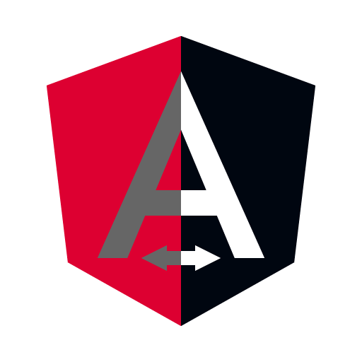

<div align="center">
  <a href="https://ngx-eco.github.io/ngx-themes">
    
  </a>
</div>

<h1 align="center">@fil0157/ngx-themes</h1>

<div align="center">
  <a href="https://npmjs.org/package/ngx-themes">
    
  </a>
  <a href="https://travis-ci.org/ngx-eco/ngx-themes">
    
  </a>
  <a href="https://npmjs.org/package/ngx-themes">
    
  </a>
  <a href="https://bundlephobia.com/result?p=ngx-themes">
    
  </a>
  <a href="https://npmjs.org/package/ngx-themes">
    
  </a>
</div>

<div align="center">
  <strong>@ngx-eco/ngx-themes</strong> is a Angular module for creating themes in Angular applications using native css variables.
</div>

## Table of Contents

- [Features](#Features)
- [Demo](#Demo)
- [Quickstart](#Quickstart)
- [Documentation](#documentation)
- [Roadmap](#Roadmap)
- [Changelog](#Changelog)
- [Copyright](#Copyright)
- [MIT License](#MIT-License)

## Features

- **Small**: Just 1 KB (minified and gzipped). [Size Limit](https://github.com/ai/size-limit) controls the size.
- **Tree-shakeable**: Only the parts you use will be imported into your app's bundle.
- **Fast**: Built with functional components only.
- **Bulletproof**: Written in strict TypeScript and covered by 80+ tests.
- **Simple**: The interface is straight forward and easy to use.
- **Mobile-friendly**: Works well on mobile devices and touch screens.
- **Minimal dependencies**

## Demo

- [Website](https://ngx-eco.github.io/ngx-themes)

## Quickstart

**Clone the repo:**

``` bash
git clone https://github.com/ngx-eco/ngx-themes.git
```

**Install with [npm](https://www.npmjs.com):**

``` bash
npm i @ngx-eco/ngx-themes
```

**Install with [yarn](https://yarnpkg.com/):**

``` bash
yarn add @ngx-eco/ngx-themes
```

## Documentation

[The documentation](https://ngx-eco.github.io/ngx-themes/docs) can be found at <https://ngx-eco.github.io/ngx-themes>. 

## Roadmap

- [x] TypeScript support
- [] Angular Universal support (SSR)

## Changelog

For changelogs, check out [the Releases section of @ngx-eco/ngx-themes](https://github.com/ngx-eco/ngx-themes/releases)
or the [CHANGELOG.md](CHANGELOG.md).

## Copyright

Code Copyright 2020 @ngx-eco/ngx-themes.

## MIT License

```
Copyright (c) 2020 @ngx-eco/ngx-themes

Permission is hereby granted, free of charge, to any person obtaining a copy
of this software and associated documentation files (the "Software"), to deal
in the Software without restriction, including without limitation the rights
to use, copy, modify, merge, publish, distribute, sublicense, and/or sell
copies of the Software, and to permit persons to whom the Software is
furnished to do so, subject to the following conditions:

The above copyright notice and this permission notice shall be included in all
copies or substantial portions of the Software.

THE SOFTWARE IS PROVIDED "AS IS", WITHOUT WARRANTY OF ANY KIND, EXPRESS OR
IMPLIED, INCLUDING BUT NOT LIMITED TO THE WARRANTIES OF MERCHANTABILITY,
FITNESS FOR A PARTICULAR PURPOSE AND NONINFRINGEMENT. IN NO EVENT SHALL THE
AUTHORS OR COPYRIGHT HOLDERS BE LIABLE FOR ANY CLAIM, DAMAGES OR OTHER
LIABILITY, WHETHER IN AN ACTION OF CONTRACT, TORT OR OTHERWISE, ARISING FROM,
OUT OF OR IN CONNECTION WITH THE SOFTWARE OR THE USE OR OTHER DEALINGS IN THE
SOFTWARE.
```
